# Kubernetes Intro Hands-On-Lab

Lab Description

**Content**

- [Kubernetes Intro Hands-On-Lab](#kubernetes-intro-hands-on-lab)
- [Kubernetes Intro](#kubernetes-intro)
  - [Abstract and learning objectives](#abstract-and-learning-objectives)
  - [Overview](#overview)
  - [Exercise 1: Create and run a Docker application](#exercise-1-create-and-run-a-docker-application)
    - [Task 1: Create a Dockerfile](#task-1-create-a-dockerfile)
    - [Task 2: Create Docker images](#task-2-create-docker-images)
    - [Task 3: Run a containerized application](#task-3-run-a-containerized-application)
    - [Task 4: Run several containers with Docker compose](#task-4-run-several-containers-with-docker-compose)
  - [Exercise 2: Deploy the solution to Kubernetes](#exercise-2-deploy-the-solution-to-kubernetes)
    - [Task 1: Connect to the Kubernetes Cluster](#task-1-connect-to-the-kubernetes-cluster)
    - [Task 2: Create the Deployment for Mongo DB](#task-2-create-the-deployment-for-mongo-db)
    - [Task 3: Create the Deployment for the API](#task-3-create-the-deployment-for-the-api)
    - [Task 4: Deploy the Web Interface](#task-4-deploy-the-web-interface)
  - [Exercise 3: Testing Kubernetes Deployment](#exercise-3-testing-kubernetes-deployment)
    - [Task 1: Restarting a Deployment](#task-1-restarting-a-deployment)
    - [Task 2: Scaling a Deployment](#task-2-scaling-a-deployment)
    - [Task 3: Add CPU limits and requests](#task-3-add-cpu-limits-and-requests)
  - [After the hands-on lab](#after-the-hands-on-lab)


# Kubernetes Intro

## Abstract and learning objectives

This hands-on lab is designed to guide you through the process of building and deploying Docker images to the Kubernetes, in addition to learning how to work with dynamic service discovery, service scale-out, and high-availability.

At the end of this lab you will be better able to build and deploy containerized applications to Kubernetes.

## Overview

FabMedical provides conference website services tailored to the medical community. They are refactoring their application code, based on node.js, so that it can run as a Docker application, and want to implement a POC that will help them get familiar with the development process, lifecycle of deployment, and critical aspects of the hosting environment. 

In this hands-on lab, you will assist with completing this POC with a subset of the application codebase. You will create Docker Image based on Linux, and a Kubernetes  Cluster for running deployed applications. You will be helping them to complete the Docker setup for their application, test locally, push to an image repository, deploy to the cluster, and test load-balancing and scale.

## Exercise 1: Create and run a Docker application

In this exercise, you will take the starter files and run the node.js application as a Docker application. You will create a Dockerfile, build Docker images, and run containers to execute the application.

### Task 1: Create a Dockerfile

To start we must first create a docker file this is where we will define our container application.

To do this open the content api on your favorite file editor (for this workshop we will use [VSCode](https://code.visualstudio.com/))

```powershell
cd ./content/content-api
code .
```

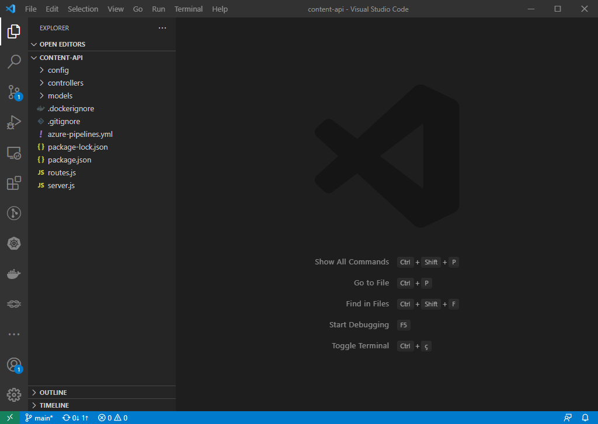

Create a new File with the name Dockerfile 

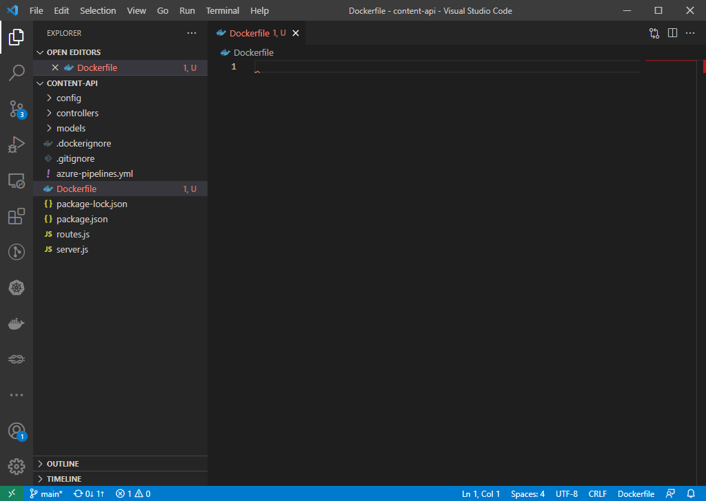

Type the following into the file. These statements produce a Dockerfile that describes the following:

   - The base stage includes environment setup which we expect to change very rarely, if at all.

     - Creates a new Docker image from the base image node:alpine. This base image has node.js on it and is optimized for small size.


     - Creates a directory on the image where the application files can be copied.

     - Exposes application port 3001 to the container environment so that the application can be reached at port 3001.

   - The build stage contains all the tools and intermediate files needed to create the application.

     - Creates a new Docker image from node:argon.

     - Creates a directory on the image where the application files can be copied.

     - Copies package.json to the working directory.

     - Runs npm install to initialize the node application environment.

     - Copies the source files for the application over to the image.

   - The final stage combines the base image with the build output from the build stage.

     - Sets the working directory to the application file location.

     - Copies the app files from the build stage.

     - Indicates the command to start the node application when the container is run.

The complete file will look as the following:

```Dockerfile
   FROM node:alpine AS base
   RUN apk -U add curl
   WORKDIR /usr/src/app
   EXPOSE 3001

   FROM node:argon AS build
   WORKDIR /usr/src/app

   # Install app dependencies
   COPY package.json /usr/src/app/
   RUN npm install

   # Bundle app source
   COPY . /usr/src/app

   FROM base AS final
   WORKDIR /usr/src/app
   COPY --from=build /usr/src/app .
   CMD [ "npm", "start" ]
```
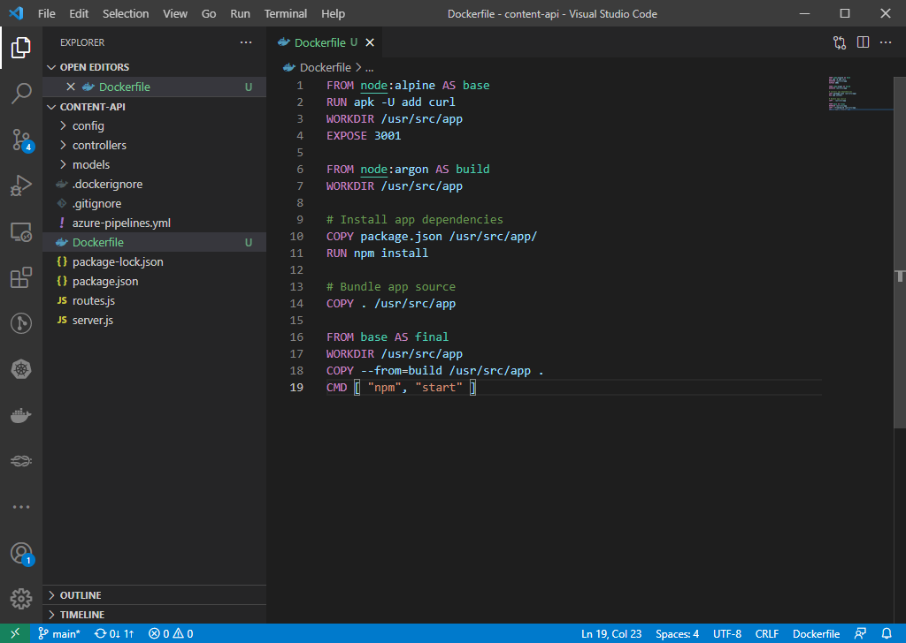

### Task 2: Create Docker images


In this task, you will create Docker images for the application --- one for the API application and another for the web application. Each image will be created via Docker commands that rely on a Dockerfile.

From the content-api folder containing the API application files and the new Dockerfile you created, type the following command to create a Docker image for the API application. This command does the following:

   - Executes the Docker build command to produce the image

   - Tags the resulting image with the name content-api (-t)

   - The final dot (".") indicates to use the Dockerfile in this current directory context. By default, this file is expected to have the name "Dockerfile" (case sensitive).

```powershell
docker image build -t content-api .
# Run ls to confirm the image created and was tagged correctly
docker image ls 
```

Navigate to the content-web folder and using the existing Dockerfile in this directory build the image.

```powershell
cd ../content-web
ls
```
Check the Dockerfile by running

```powershell
code ./Dockerfile
```

and build the image with the following command

```powershell
docker image build -t content-web .
```

finally do the same to on the content-init folder

```powershell
cd ../content-init
docker image build -t content-init .
```

After this you have built the docker images you can run :

```powershell
docker image ls
```

and view all the created image

### Task 3: Run a containerized application

The web application container will be calling endpoints exposed by the API application container and the API application container will be communicating with mongodb.

 Create and start the API application container with the following script. The script does the following:

   - Create fabmedical network for your application
  
   - Create MongoDD connected to the network

   - Init MongoDb Configuration  

   - Names the container "api" for later reference with Docker commands.

   - Instructs the Docker engine to use the "fabmedical" network.

   - Instructs the Docker engine to use port 3001 and map that to the internal container port 3001.

   - Creates a container from the specified image, by its tag, such as content-api.

   ```powershell
   docker network create fabmedical
   docker container run --name mongo --net fabmedical -p 27017:27017 -d mongo
   docker container run --name init --net fabmedical -e MONGODB_CONNECTION=mongodb://mongo:27017/contentdb content-init
   docker container run --name api --net fabmedical -p 3001:3001 content-api
   ```

   Unfortanetly this command will fail in the final step since the api container can't reach the mongodb instance even if it is in the same network.
   ```
   > content-api@0.0.0 start
> node ./server.js

Listening on port 3001
Could not connect to MongoDB!
MongooseServerSelectionError: connect ECONNREFUSED 127.0.0.1:27017
npm notice
npm notice New minor version of npm available! 7.15.1 -> 7.16.0
npm notice Changelog: <https://github.com/npm/cli/releases/tag/v7.16.0>
npm notice Run `npm install -g npm@7.16.0` to update!
npm notice
   ```
To fix this we have to inject the mongodb connection string into the container

```powershell
docker container rm api
docker container run --name api --net fabmedical -p 3001:3001 -e MONGODB_CONNECTION=mongodb://mongo:27017/contentdb -d content-api
```


Enter the command to show running containers. You will observe that the "api" container is in the list. Use the docker logs command to see that the API application has connected to mongodb.

   ```powershell
   docker container ls
   docker container logs api
   ```

If you want to see the API in the browser go to http://localhost:3001 to see the API responding

   Now that the API and the mongodb are running we can run the web interface, to do this run

   ```powershell
   docker container run --name web --net fabmedical -p 3000:3000 -d -e CONTENT_API_URL=http://api:3001 content-web
   ```
   Enter the command to show running containers again, and you will observe that both the API and web containers are in the list. The web container shows a dynamically assigned port mapping to its internal container port 3000.

   ```powershell
   docker container ls
   ```

Now you can access the application via the browser by going to http://localhost:3000 and viewing the application.

### Task 4: Run several containers with Docker compose

Finally to simplify your deployments and testing you can use docker compose to manage your multiple containers.

First, cleanup the existing containers.

```powershell
docker container stop web && docker container rm web
docker container stop api && docker container rm api
docker container rm init
docker container stop mongo && docker container rm mongo
```

Now go to the content folder  where all the code is located and create a docker-compose.yaml and add the following content

```yaml
version: "3.4"

services:
  mongo:
    image: mongo
    restart: always

  api:
    build: ./content-api
    image: content-api
    depends_on:
      - mongo
    environment:
      MONGODB_CONNECTION: mongodb://mongo:27017/contentdb

  web:
    build: ./content-web
    image: content-web
    depends_on:
      - api
    environment:
      CONTENT_API_URL: http://api:3001
    ports:
      - "3000:3000"
```

Now if you execute this docker compose file right now by running

```powershell
docker-compose -f docker-compose.yml -p fabmedical up -d
```

It will launch the website but all the content will be gone except the template html.

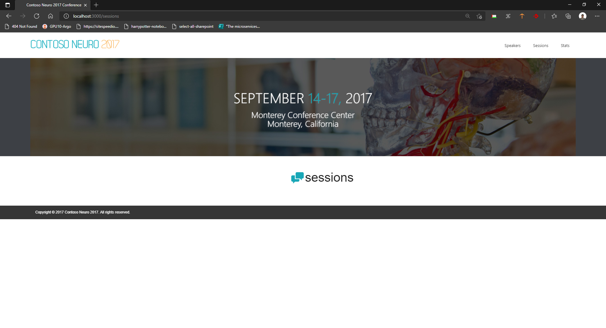

This happens because we did not initialized our DB to do this we can add the init container to the docker compose this way the data will be imported during the compose command.

```yaml
version: "3.4"

services:
  mongo:
    image: mongo
    restart: always

  init:
    build: ./content-init
    image: content-init
    depends_on:
      - mongo
    environment:
      MONGODB_CONNECTION: mongodb://mongo:27017/contentdb

  api:
    build: ./content-api
    image: content-api
    depends_on:
      - mongo
    environment:
      MONGODB_CONNECTION: mongodb://mongo:27017/contentdb

  web:
    build: ./content-web
    image: content-web
    depends_on:
      - api
    environment:
      CONTENT_API_URL: http://api:3001
    ports:
      - "3000:3000"

```

Now we remove the previous containers by running

```powershell
docker-compose -f docker-compose.yml -p fabmedical down
```

and restart by running

```powershell
docker-compose -f docker-compose.yml -p fabmedical up -d
```

After this visit http://localhost:3000 to see the app running with content

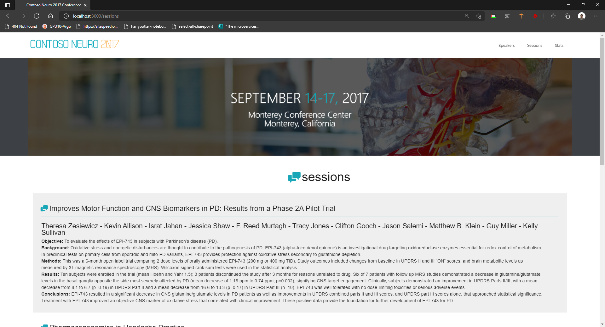

Before moving on to the next exercise remove the website via the docker compose by running 

```powershell
docker-compose -f docker-compose.yml -p fabmedical down
```


## Exercise 2: Deploy the solution to Kubernetes 


In this exercise, you will connect to the 
 Kubernetes cluster in Docker Desktop and deploy the Docker application to the cluster.

If you want to do this exercise by skipping the first exercise please perform the first 2 tasks in that Exercise as they are necessary for this one, or everytime it uses any custom imagen (content-\*) replace it with (hugos99/content-\*).

### Task 1: Connect to the Kubernetes Cluster

Before you connect to the Kubernetes Cluster validate that you have turn on Kubernetes in Docker Desktop so that you have a local Kubernetes Cluster.

if it's not on turn it on and restart Docker Desktop (this will take a couple minutes but it's pretty quick)

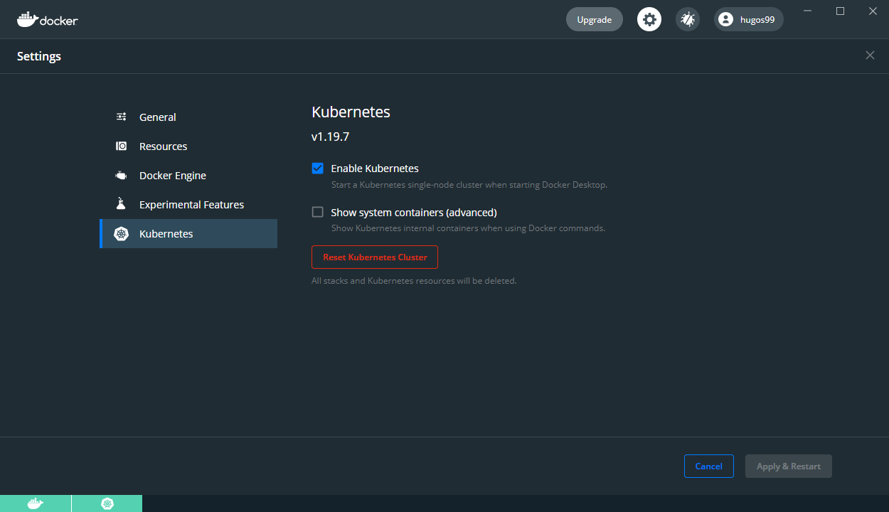

After this open [Kubernetes Lens](https://k8slens.dev/) and select add cluster on the bar to the right, select the default .kubeconfig and choose the context called docker-desktop and add the cluster (see picture bellow).

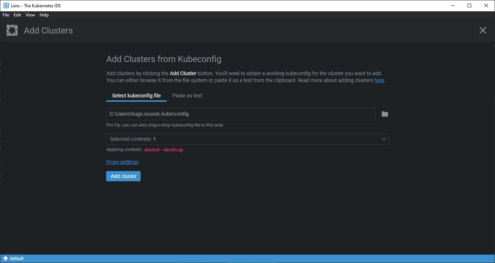

Task 2: Deploy the API to Kubernetes

In this task, you will deploy the API application to the Azure Kubernetes Service Cluster.

First create a directory where we will store all the manifests

```powershell
mkdir manifest
```

After that we want to create a namespace for our application, a namespace is a way to divide a Kubernetes cluster into a series of different environments they are great to help you divide applications in different ways such as:

* Development/Quality/Production Environments
* Tenant1/Tenant2/Tenant3 Environments
* ...

We want our application to run in it's own environment so we have to create a namespace to do this create a file named namespace.yaml and insert the following content

```yaml
apiVersion: v1
kind: Namespace
metadata:
  name: fabmedical #kubernetes objects often have to have DNS compliant name this  is because kubernetes might use these names as DNS entriees internally
```

We will use this in future Kubernetes Objects to ensure all objects are in the same namespace 

After creating the file copy the path of the manifest folder and open a terminal session in lens' terminal simulator

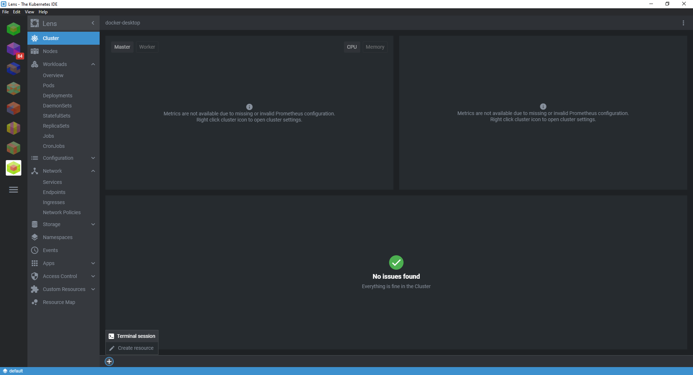

Open the terminal and navigate to the manifests folder

Once in the folder run

```powershell
kubectl apply -f .
```

This will apply all kubernetes manifests in the folder (in our case the namespace manifest), once this is done you can go to the Namespaces tab in lens and see the new namespace.

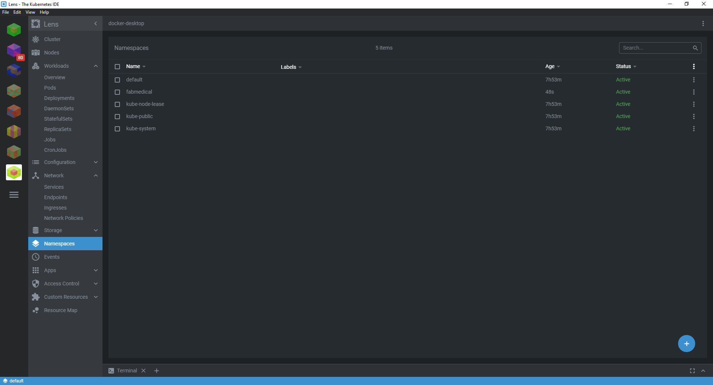

Now that we created our Namespace lets get our api working.

Our API has a dependency in the MongoDB, in a Production Environment the best option would most likely be to host this DB in a Cloud Provider like CosmosDB. But since we are hosting in our machines to learn Kubernetes we can create a mongoDB instance and populate it using the init-container.

To do this we have to create 3 things:

*   A deployment that will define the MongoDb Container.
*   A service to reach this Container.
*   A single execution Pod that will initialize the DB.

So now we can create a single file named mongodb.yaml and we will build all this by steps.

### Task 2: Create the Deployment for Mongo DB
   
A deployment is composed by a template of a Pod that it will replicate, a selector so the deployment knows what pods to manage and a replica number so it know what the intended number of replicas is.
```yaml
apiVersion: apps/v1 
kind: Deployment
metadata:
  name: mongodb
  namespace: fabmedical #the namespace for the resource
spec:
  selector: #this defines the labels that we are looking for
    matchLabels:
      app: mongodb
  replicas: 1 #only use 1 replica here
  template:
    metadata:
      labels: #here we can see the labels as we
         app: mongodb
    spec:
      containers:
      - name: mongo 
        image: mongo # here we have the image name by default it uses Docker hubs images
        ports:
        - containerPort: 27017
---
```

Now we can run the kubectl apply command and see the Deployment being created and the Pod

```powershell
kubectl apply -f .
```

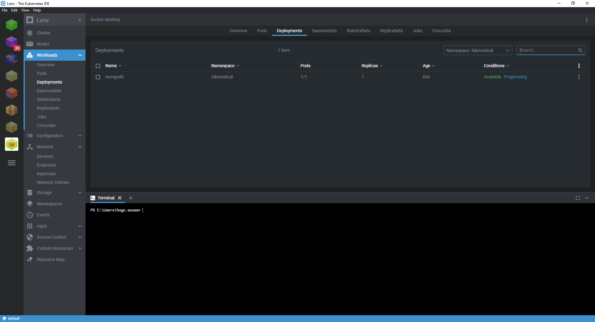

Now that we have the Deployment created we have to create a service so that we can reach our container

The service will do as the deployment and use a selector to find the target pods. The service will look like this

```yaml
--- #we can add multiple kubernetes objects in a single yaml by using the --- to seperate the objects
apiVersion: v1
kind: Service
metadata:
  name: mongo #service name, this is the name that other services in the same namespace will use to reach mongo
  namespace: fabmedical
spec:
  ports: #the container's port and the service port
  - port: 27017
    targetPort: 27017
  selector: #the selector to find target Pods
    app: mongodb

```

Now we can run the Kubectl command to create the Service 

```powershell
kubectl apply -f .
```

And in Lens we can see the service here:

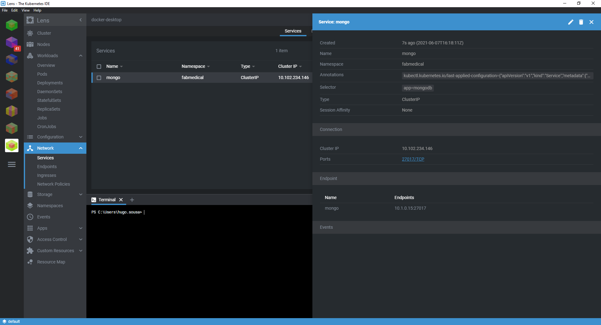

Finally we can create the content-init container that we will use to bootstrap the DB

Since we only want to execute this once and not maintain this container instead of creating a deployment for this container we can simple create a singular Pod

```yaml
apiVersion: v1
kind: Pod
metadata:
  name: content-init
  namespace: fabmedical
spec:
  containers:
    - name: content-init
      image: content-init
      env:
        - name: MONGODB_CONNECTION
          value: "mongodb://mongo:27017/contentdb"
      imagePullPolicy: IfNotPresent #This is so Docker Desktop uses the local image and not one from Docker Hub
  restartPolicy: Never # This is so the moment the Container ends the Pod considers that it is complete
```

Now we have the MongoDb prepared and we need to deploy the API

### Task 3: Create the Deployment for the API

To do the deployment of the API have to:

1. Create a deployment and configurations for the API
2. Create a service for the API
3. Test the API

So we start with the API Deployment, but we have a problem which is the MongoDB connection string (in the previous step we added it via a environment variable to the content-init pod) we don't want this Connection String to be accessible to all cluster users this is unsafe on top of that what if we change the connection string we would have to change every deployment that might share this. To fix both these problems we can use a Kubernetes Secret.

To create a secret we need the original string encoded to base64 we can do this online or by running the following powershell script

```powershell
[string]$sStringToEncode="mongodb://mongo:27017/contentdb"
$sEncodedString=[Convert]::ToBase64String([System.Text.Encoding]::UTF8.GetBytes($sStringToEncode))
write-host "Encoded String:" $sEncodedString
```

This results in the string "bW9uZ29kYjovL21vbmdvOjI3MDE3L2NvbnRlbnRkYg==" that we now have to turn into a secret

```yaml
apiVersion: v1
kind: Secret
metadata:
  name: mongodb-access
  namespace: fabmedical
type: Opaque
data:
  MONGODB_CONNECTION: bW9uZ29kYjovL21vbmdvOjI3MDE3L2NvbnRlbnRkYg==
```

In lens it looks like this

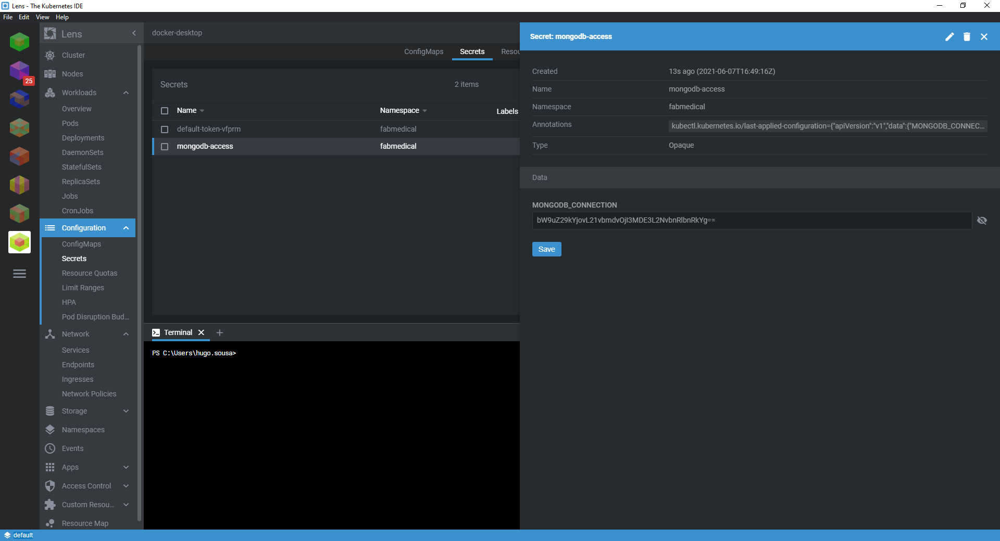

Now that we have our secret we need to create our deployment and inject the secret into it so we create a deployment similar to the mongodb one.

```yaml
apiVersion: apps/v1 
kind: Deployment
metadata:
  name: content-api
  namespace: fabmedical 
spec:
  selector: 
    matchLabels:
      app: content-api
  replicas: 3
  template:
    metadata:
      labels: 
         app: content-api
    spec:
      containers:
      - name: content-api 
        image: content-api 
        ports:
        - containerPort: 3001
        imagePullPolicy: IfNotPresent
        env:
          - name: MONGODB_CONNECTION
            valueFrom:
              secretKeyRef:
                  name: mongodb-access
                  key: MONGODB_CONNECTION
      
```

Now we apply this using kubectl 

And we can see this in Lens

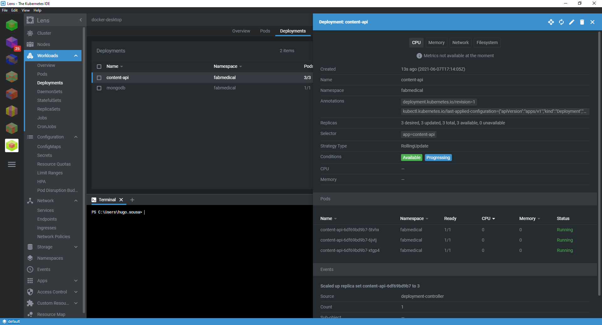

Now that we have the deployment we need to create a service that can be reached by the user so we can test the API even if it is inside Kubernetes, to do this we need a special type of service that can be reached from outside of the Kubernetes Cluster.

Since we are using a local Cluster we can't get a public Ip unlike in a Azure Kubernetes Service so we will use a NodePort Service, this type of services exposes the endpoint via a port on the local machine.

```yaml
apiVersion: v1
kind: Service
metadata:
  name: api
  namespace: fabmedical
  labels:
    app: content-api
spec:
  type: NodePort # Where we define the Type of service we want to use
  ports:
  - port: 80 # we redirect from the port 3001 of the container to the port 80 internally so it's easier to pass the connection string
    targetPort: 3001
    nodePort: 32222 #The actual node port we will use that can be selected from the range  30000-32767
  selector:
    app: content-api
```

Now we apply our service and validate in Lens

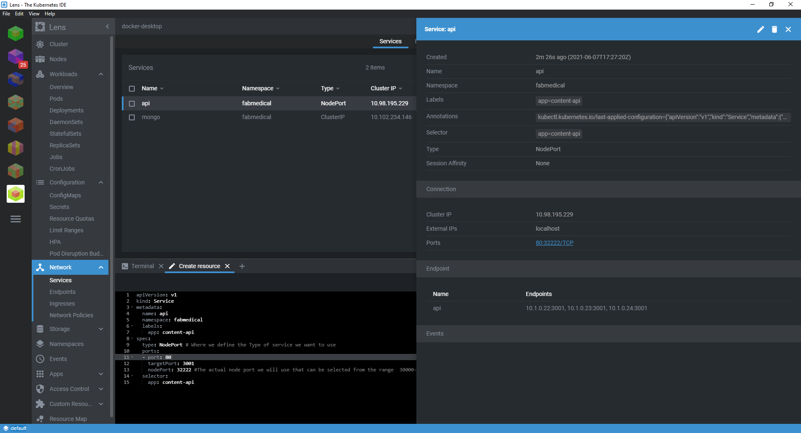

We can run
```powershell
curl http://localhost:32222/sessions
``` 
to validate the API is working as intended via the NodePort.


This concludes the API Deployment all that is missing is the Web Interface.

### Task 4: Deploy the Web Interface

To Deploy the Web interface we have to do the same steps as the UI:
1. Create a Deployment for the Web Interface
2. Create a Service for the Web Interface
3. Test the Web Interface

The Deployment for the web interface will be very similar to the api the only major difference is that we will not use secrets in the configuration of the Pod instead injecting the Variable directly.

```yaml
apiVersion: apps/v1 
kind: Deployment
metadata:
  name: content-web
  namespace: fabmedical 
spec:
  selector: 
    matchLabels:
      app: content-web
  replicas: 2
  template:
    metadata:
      labels: 
         app: content-web
    spec:
      containers:
      - name: content-web 
        image: content-web 
        ports:
        - containerPort: 3000
        imagePullPolicy: IfNotPresent
        env:
          - name: CONTENT_API_URL
            value: http://api # We can change this from the Compose because the api service is responding to the Port 80 and not the 3001
```

We apply this and we can navigate to the same tab as in the API deployment to validate the Deployment

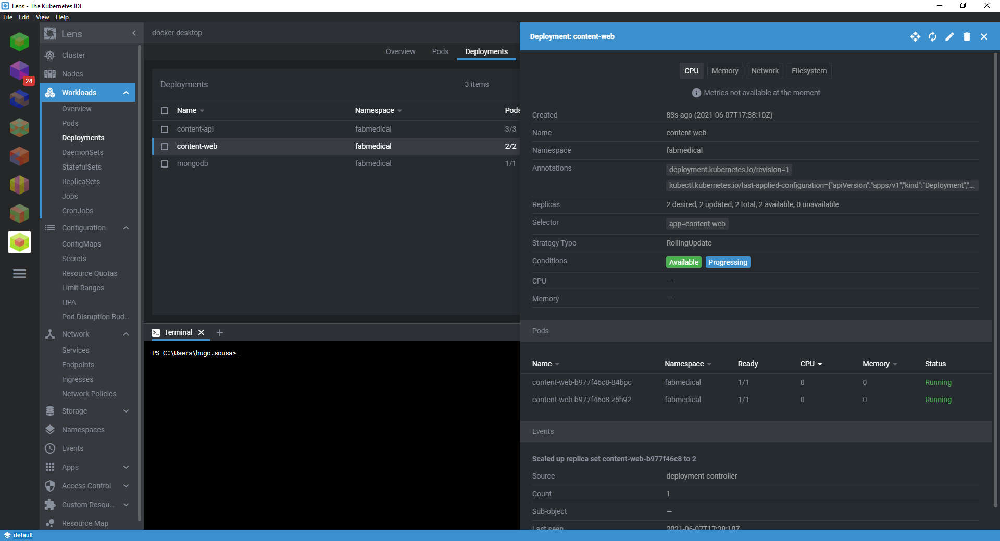

All that is left is to Deploy the Service.
This is the same scenario as the API in that since we are running locally we have to use a NodePort Service to expose our application.

That lead to the following Service:
```yaml
apiVersion: v1
kind: Service
metadata:
  name: web
  namespace: fabmedical
  labels:
    app: content-web
spec:
  type: NodePort 
  ports:
  - port: 80
    targetPort: 3000
    nodePort: 30001 #this is the final port of our application
  selector:
    app: content-web
```

After Applying this file all that's left is to visit the page http://localhost:30001 and view our website.

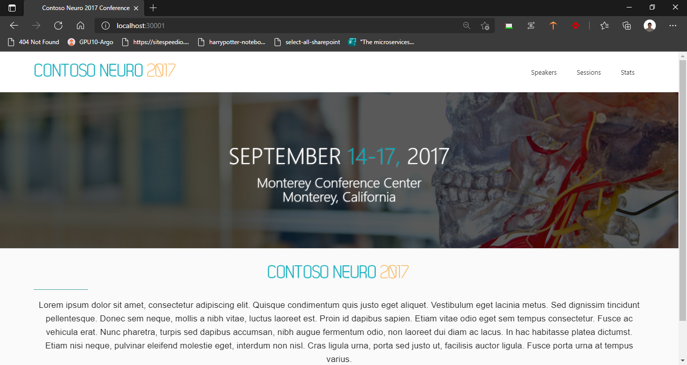

## Exercise 3: Testing Kubernetes Deployment

This Exercise requires that the previous exercise be completed.

Now that the Application is deployed we are going to start exploring Kubernetes and it's mechanisms.

### Task 1: Restarting a Deployment

Let's start by seeing how Kubernetes reacts to a change in the Deployment.

To do this we can simulate a change by forcing a restart to the deployment.
We can choose from 2 Deployments (The MongoDB Deployment is for showcase only and is not suitable for these tests) the Web interface and the Api.

For these tests the Api is better suited since the Web interface provides us with an indication of which Pod is responding to the requests at http://localhost:30001/stats.

We can see the Loadbalencing working as the hostname of the responses changes.

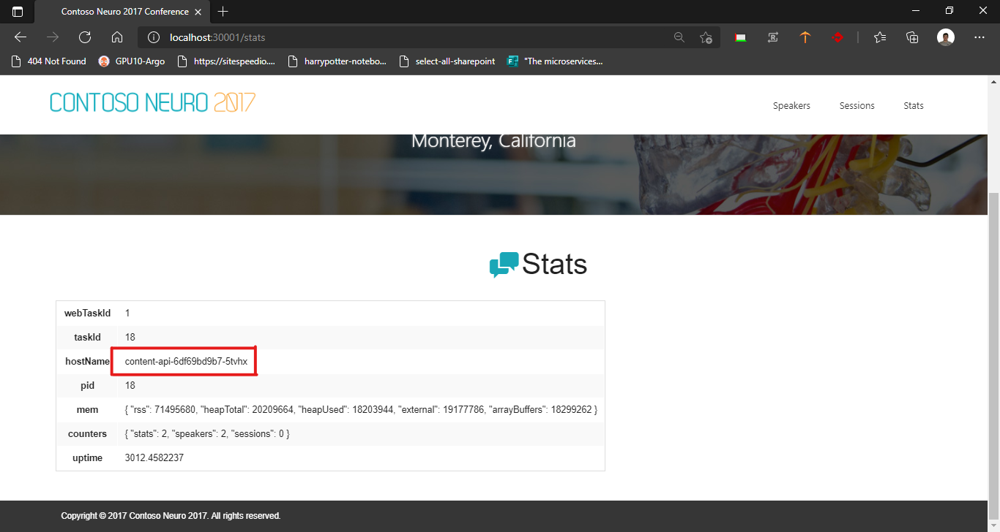

To trigger the restart we can use the command

```powershell
kubectl rollout restart deployment/content-api -n fabmedical
```

Run this command with Lens opened on the Pods tabs and see Kubernetes doing a green blue deployment with zero downtime.

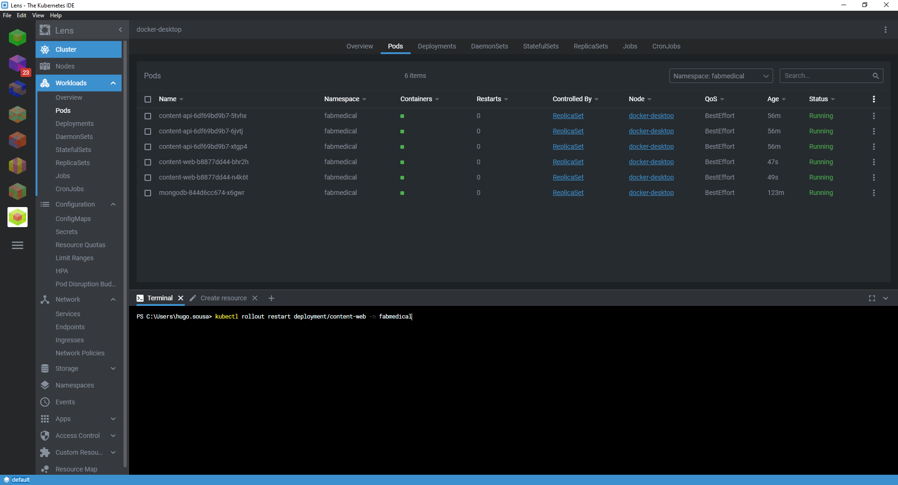

### Task 2: Scaling a Deployment

With our applications deployed we can now try to scale up our apps so they can better distribute traffic across our cluster.

We can do this by editing our deployment file and increasing the number of replicas then applying the changes or using Lens and selecting the deployment and increase it's replicas:

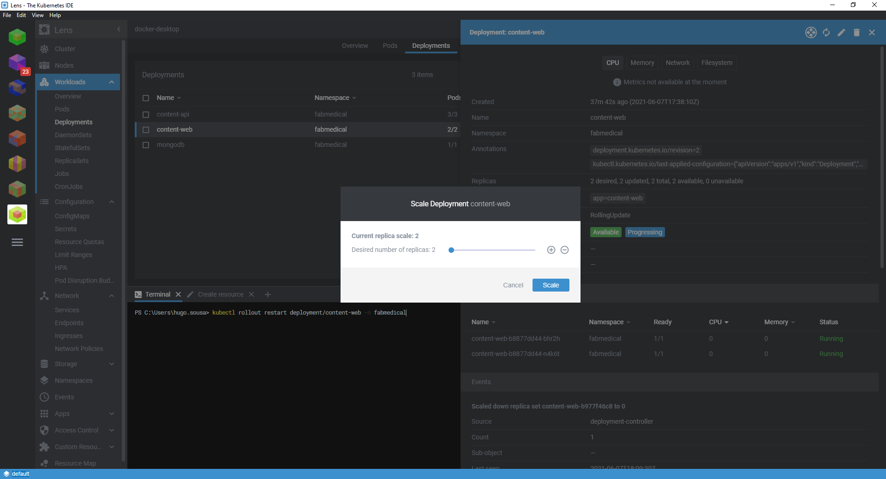

### Task 3: Add CPU limits and requests

The final task for the workshop is to add CPU limits and requests.

These requests and limits are used by Kubernetes to better orchestrate our workloads by knowing the minimum and the maximum resources that a Pod can have.

To do this we edit the Web deployment so the Pod templates now include a limit and a request.

```yaml
apiVersion: apps/v1 
kind: Deployment
metadata:
  name: content-web
  namespace: fabmedical 
spec:
  selector: 
    matchLabels:
      app: content-web
  replicas: 2
  template:
    metadata:
      labels: 
         app: content-web
    spec:
      containers:
      - name: content-web 
        image: content-web 
        resources:
          requests:
            cpu: 100m
            memory: 100Mi
          limits:
            cpu: 200m
            memory: 400Mi
        ports:
        - containerPort: 3000
        imagePullPolicy: IfNotPresent
        env:
          - name: CONTENT_API_URL
            value: http://api 
```

## After the hands-on lab

To finish delete the fabmedical namespace so all the resources created in this Lab are deleted and no longer consume resources of the machine.

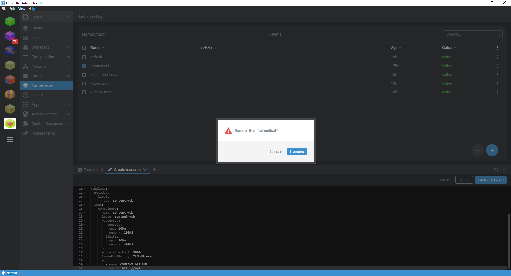